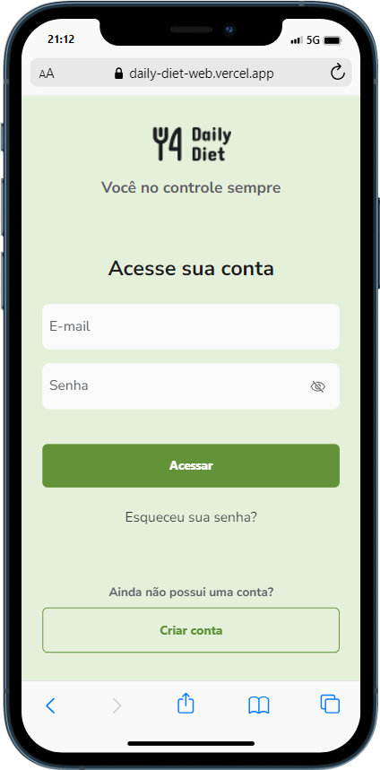
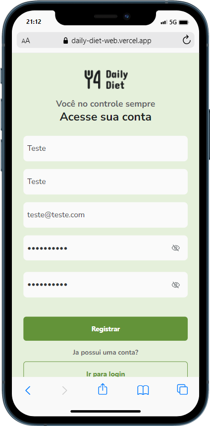
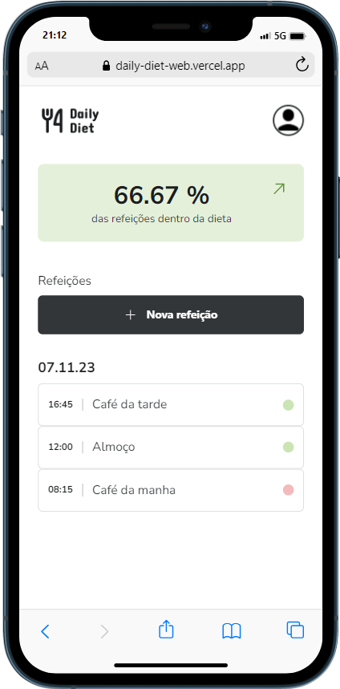
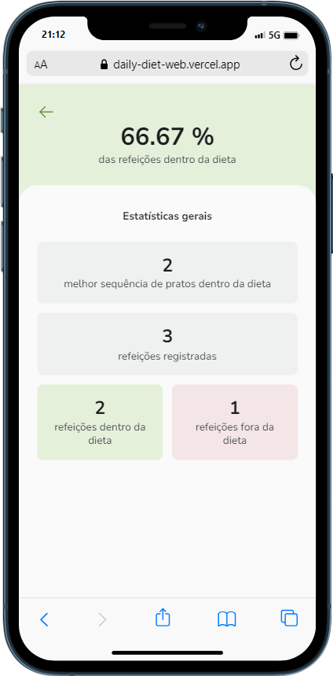
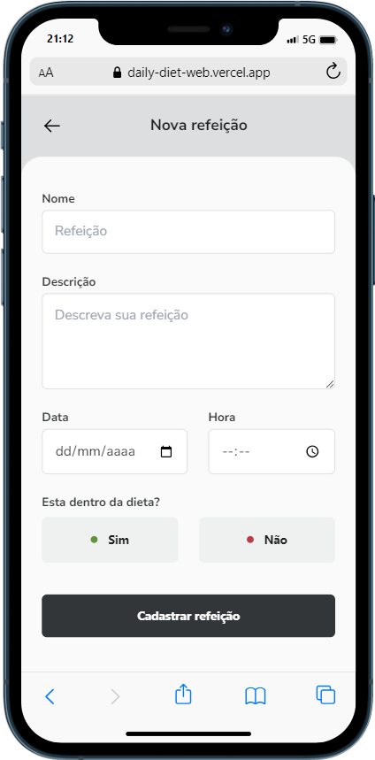
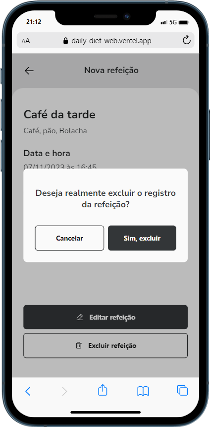

# Daily diet web |

> Adaptação projeto mobile para versão web. Este é um projeto fornecido pela [Rocketseat](http://app.ropcketseat.com.br) e tem fins acadêmicos, onde o objetivo foi transformar uma projeto de react native para React versão web. Utilizei do conceito mobile first e adicionei novas funcionalidades para login, registro de usuario e reset de senha. O projeto se comunica com a api criado em NodeJs hospedado no Render e com banco Postgres.

## 100% Responsive

## Detalhes do aplicativo

- O Daily diet web é uma aplicação completa para registro de refeições diarias e coleta de metricas para acompanhamento de dieta. Com uma conta unica para cada usuario, com autenticação via Jwt, o usuario se conecta a sua conta e faz seus registros de refeições, visualiza por data e hora e também acompanha suas metricas.
A aplicação é voltada para dispositivos móveis, entretanto possui um responsivo para tels maiores.

## 🚀 Melhorias implementadas

- [x] - Pagina de login de usuario.
- [x] - Pagina de registro de usuario.
- [x] - Alertas na tela.
- [x] - Recuperação de senha.
- [x] - Segurança jwt.
- [x] - Loading e skeleton para melhorar o UX do usuario.
- [x] - Métricas sobre seus registros.

## 💻 Como usar o projeto

Esse projeto está hospedado pela vercel e pode ser acessado pelo link abaixo:

[Deploy](https://daily-diet-web.vercel.app/login)

### 🛠 Tecnologias

As seguintes ferramentas foram usadas na construção do projeto:

- [ViteJs](https://vitejs.dev/)
- [React](https://pt-br.reactjs.org/)
- [Tailwindcss](https://tailwindcss.com/)
- [Redux](https://redux.js.org/i)
- [TypeScript](https://www.typescriptlang.org/)
- [Axios](https://axios-http.com/ptbr/docs/intro)
- [React-hook-form](https://react-hook-form.com/)

## 🌐 Links úteis

[ReactJs](https://react.dev/)
[ViteJs](https://vitejs.dev/)
[Figma do projeto](<https://www.figma.com/file/vSWmpP1whR65EDNj9Rtnh7/Daily-Diet-%E2%80%A2-Desafio-React-Native-(Community)-(Copy)?type=design&node-id=0-1&mode=design&t=tHho3uX7gQJhamgI-0>)

## Eduardo Ananias da Silva

